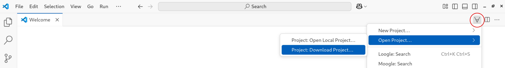

# One-day Workshop on Formalising Mathematics in Lean

This is the repository for the one-day workshop on Formalising Mathematics in Lean
as part of the Summer School on Geometry held at Utrecht University on August 15, 2025.
It contains the course material, including lectures, exercises and project sketches.

## Before the workshop

To get started with Lean, we recommend to play a few worlds of the
[Natural Number Game](https://adam.math.hhu.de/#/g/leanprover-community/nng4). This will introduce you to
some basic concepts of a proof assistant.

## Online Lean usage

To follow the course, you don't necessarily need a local Lean installation. Instead,
you can use the [online Lean editor](https://live.lean-lang.org/). Beware that your progress is not saved there,
so make sure that you copy your code from time to time to a local file.

Links to sections:

- [Introduction](https://live.lean-lang.org/#url=https%3A%2F%2Fraw.githubusercontent.com%2Fformal-methods-nl%2Fuu-geometry-2025%2Frefs%2Fheads%2Fmaster%2FUuGeometry2025%2FLectures%2F01Introduction.lean%3Ftoken%3DGHSAT0AAAAAACW4X3GFY5V7NVIQMCYIO2RK2E6N5KQ)
- [Logic and Sets](https://live.lean-lang.org/#url=https%3A%2F%2Fraw.githubusercontent.com%2Fformal-methods-nl%2Fuu-geometry-2025%2Frefs%2Fheads%2Fmaster%2FUuGeometry2025%2FLectures%2F02Logic.lean%3Ftoken%3DGHSAT0AAAAAACW4X3GERGSQJM4UB4W3TY7Q2E6N6NA) ([Exercises](https://live.lean-lang.org/#url=https%3A%2F%2Fraw.githubusercontent.com%2Fformal-methods-nl%2Fuu-geometry-2025%2Frefs%2Fheads%2Fmaster%2FUuGeometry2025%2FExercises%2F02Logic.lean))
- [Analysis](https://live.lean-lang.org/#url=https%3A%2F%2Fraw.githubusercontent.com%2Fformal-methods-nl%2Fuu-geometry-2025%2Frefs%2Fheads%2Fmaster%2FUuGeometry2025%2FLectures%2F03Analysis.lean%3Ftoken%3DGHSAT0AAAAAACW4X3GEZLM2CN3N7J4PBOVQ2E6N7OA) ([Exercises](https://live.lean-lang.org/#url=https%3A%2F%2Fraw.githubusercontent.com%2Fformal-methods-nl%2Fuu-geometry-2025%2Frefs%2Fheads%2Fmaster%2FUuGeometry2025%2FExercises%2F03Analysis.lean))
- [Algebra](https://live.lean-lang.org/#url=https%3A%2F%2Fraw.githubusercontent.com%2Fformal-methods-nl%2Fuu-geometry-2025%2Frefs%2Fheads%2Fmaster%2FUuGeometry2025%2FLectures%2F04Algebra.lean%3Ftoken%3DGHSAT0AAAAAACW4X3GFWCRY2GNOYJQKGZPS2E6N74A) ([Exercises](https://live.lean-lang.org/#url=https%3A%2F%2Fraw.githubusercontent.com%2Fformal-methods-nl%2Fuu-geometry-2025%2Frefs%2Fheads%2Fmaster%2FUuGeometry2025%2FExercises%2F04Algebra.lean))

## Local installation

To work on the exercises and your own projects, it is recommended to install Lean locally on your computer. The recommended
way is to install VS Code and the Lean extension following the first 3 steps of these
[instructions](https://docs.lean-lang.org/lean4/doc/quickstart.html).

Now, open VS Code and click on the forall symbol on the right hand side of the screen and select
`Open Project > Project: Download Project`:


There will appear a text box, in which you copy the following URL:
```
https://github.com/formal-methods-nl/uu-geometry-2025
```
After selecting a path where the project should be installed on your computer, wait for a few minutes
for everything to download and compile.

You will find the course material in the `UuGeometry2025` directory.

## Useful links

### Searching the library

Finding the right lemmas to use is hard. These websites can help you find what you need:

- [mathlib documentation](https://leanprover-community.github.io/mathlib4_docs/): mathlib library
  documentation.
- [Loogle](https://loogle.lean-lang.org/): Syntactic library search.
- [leansearch](https://leansearch.net/): LLM-powered semantic library search.

### Connecting with the community

- [Zulip chat](https://leanprover.zulipchat.com/): A discussion forum for Lean users. If you have any
  questions about Lean, feel free to ask them there.
- [Loki](https://formal-methods.nl/loki): Weekly formalisation meetup in Utrecht.
